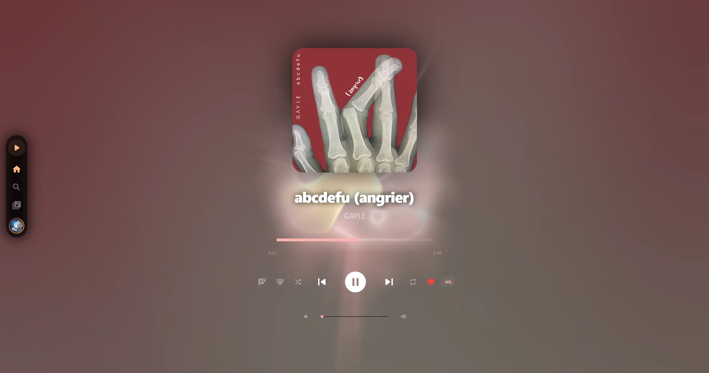
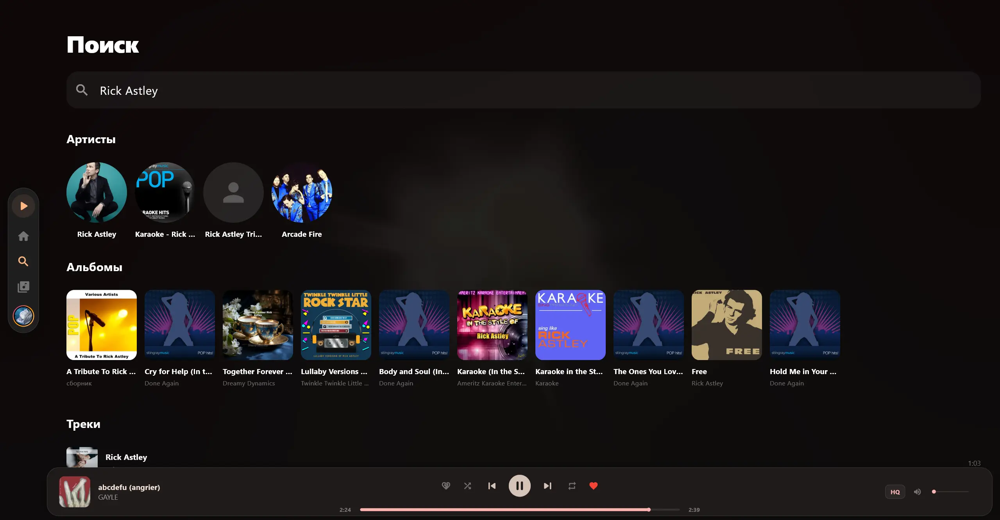
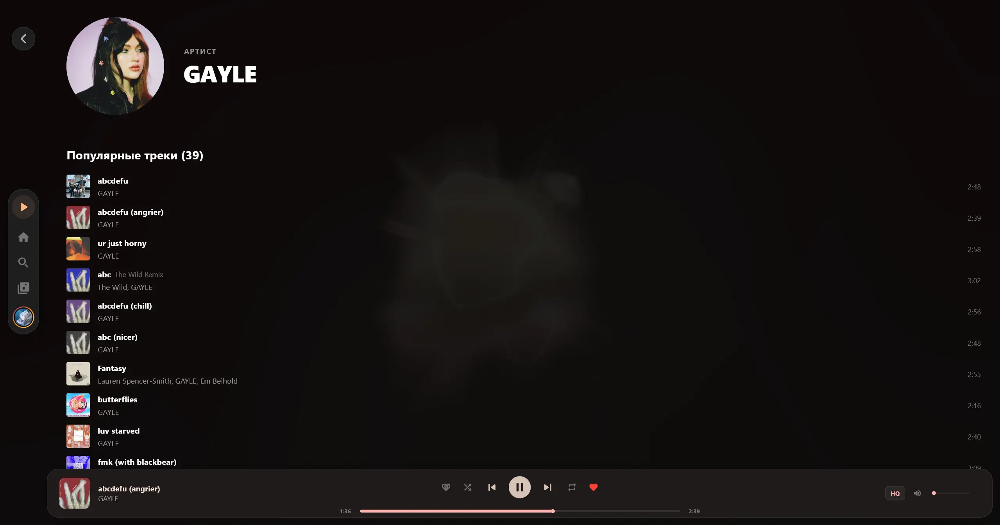

#  YouMuz (a Yandex Music client)

Альтернативный клиент для Яндекс Музыки

<table>
  <tr>
    <td align="center"></td>
    <td align="center"></td>
    <td align="center"></td>
  </tr>
</table>

## Предупреждение

**YouMuz** основан на [YaMusic](https://github.com/yamusic/yamusic) и использует неофициальное API, не предназначенное для публичного использования. Проект находится в стадии активной разработки. Пользуйтесь на свой страх и риск. Проект написан с помощью ИИ.

## Возможности

- **Приватность**: никакой аналитики и слежки со стороны клиента
- **Тексты песен**: несколько источников (LrcLib, BetterLyrics, YouLyPlus), включая пословную синхронизацию
- **Интеграция с системой**: управление из панели задач Windows, Discord Rich Presence, глобальные горячие клавиши

## Благодарности ❤️

- [Vyfor](https://github.com/vyfor) — за исходный TUI-клиент [YaMusic](https://github.com/yamusic/yamusic) и библиотеку [yandex-music-rs](https://github.com/vyfor/yandex-music-rs) для работы с API Яндекса
- [LrcLib](https://lrclib.net), [BetterLyrics](https://github.com/better-lyrics/better-lyrics), [YouLyPlus](https://github.com/ibratabian17/YouLyPlus) — за базы текстов песен

## Лицензия

Проект распространяется под лицензией [GPL-3.0](LICENSE).
